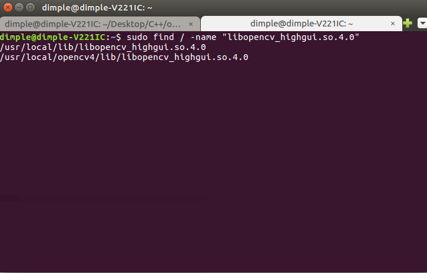
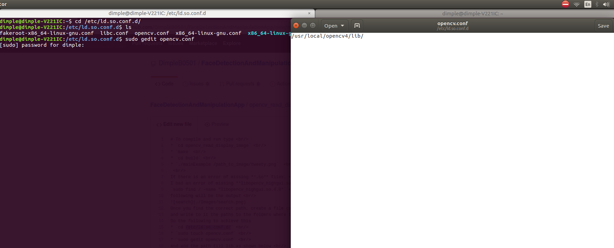

# To compile and run type  
* `cd opencv_read_display_image`  
* `make`  
* `cd build`  
* `./mainExample /path_to_image/tweety.png`   
  
 
# Fixing .so error  
If there is an error of missing **.so** files.  
I had an error of missing **libopencv_highgui.so.4.0** you can search where exactly your file is by the following command   
`sudo find / -name "libopencv_highgui.so.4.0"`  
following will be the output  

Once you find the correct path, create a file called /etc/ld.so.conf.d/opencv.conf  
and write to it the paths to the folders where the libraries are stored.  
Do the following to achieve this
* `cd /etc/ld.so.conf.d/`  
* `sudo touch opencv.conf`  
* `sudo gedit opencv.conf`  
and add the path till lib as shown below  
  
Then run  
sudo ldconfig -v  
 
Now run from build `./mainExample /path_to_image/tweety.png`    again and your code should read and display image.  
